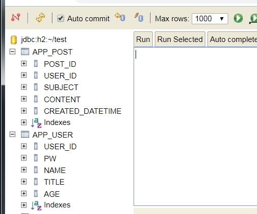

# Spring Boot Web Application Template
Template of Web Application, so I can literally copy and paste to start a web application.
Just for the testing purpose, Embedded H2 database is used.

## Template contains
* Framework : Spring Boot - 1.5.7
* ORM : JPA / Hibernate
* Database : H2 - h2-2017-04-23 (Local)	/ PostgreSQL (Cloud)
* Unit Test : jUnit + AssertJ
* Code Quality : Jacoco

## Initialization
Run the project by the following command `./gradlew bootRun` then when the Tomcat server is up, 
go to `http://localhost:8080/h2-console` on the browser.

#### Create Test Database
```
CREATE TABLE APP_USER(
    USER_ID VARCHAR(10) PRIMARY KEY,
    PW VARCHAR(100) NOT NULL,
    NAME VARCHAR(20) NOT NULL,
    TITLE VARCHAR(10),
    AGE INT
);

CREATE TABLE APP_POST(
    POST_ID INT AUTO_INCREMENT PRIMARY KEY,
    USER_ID VARCHAR(10),
    SUBJECT VARCHAR(50),
    CONTENT VARCHAR(200),
    CREATED_DATETIME DATETIME,
    FOREIGN KEY (USER_ID) REFERENCES APP_USER(USER_ID)
);

```


#### Add some test data
```
--- password is 1234 (It is Bcrypted)
INSERT INTO APP_USER(USER_ID, PW, NAME, TITLE, AGE) VALUES( 'tester1', '$2a$10$mcbZhPS7CVDPy88X7cF.7OOf7rPVOEX9aTGe1lgHC9qNm.fdYNbkS', 'Brian Heo', 'Sir', 42);
INSERT INTO APP_USER(USER_ID, PW, NAME, TITLE, AGE) VALUES('tester2', '$2a$10$mcbZhPS7CVDPy88X7cF.7OOf7rPVOEX9aTGe1lgHC9qNm.fdYNbkS', 'Phil Lee', 'Mr.', 42);
INSERT INTO APP_USER(USER_ID, PW, NAME, AGE) VALUES('tester3', '$2a$10$mcbZhPS7CVDPy88X7cF.7OOf7rPVOEX9aTGe1lgHC9qNm.fdYNbkS', 'Gerrard Lee', 43);

INSERT INTO APP_POST(USER_ID, SUBJECT, CONTENT, CREATED_DATETIME) VALUES( 'tester1', 'Test Subject 1', 'Contents of Test subject 1', CURRENT_TIMESTAMP());
INSERT INTO APP_POST(USER_ID, SUBJECT, CONTENT, CREATED_DATETIME) VALUES( 'tester2', 'Test Subject 2', 'Contents of Test subject 2', CURRENT_TIMESTAMP());
INSERT INTO APP_POST(USER_ID, SUBJECT, CONTENT, CREATED_DATETIME) VALUES( 'tester1', 'Test Subject 3', 'Contents of Test subject 3', CURRENT_TIMESTAMP());
INSERT INTO APP_POST(USER_ID, SUBJECT, CONTENT, CREATED_DATETIME) VALUES( 'tester2', 'Test Subject 4', 'Contents of Test subject 4', CURRENT_TIMESTAMP());
INSERT INTO APP_POST(USER_ID, SUBJECT, CONTENT, CREATED_DATETIME) VALUES( 'tester1', 'Test Subject 5', 'Contents of Test subject 5', CURRENT_TIMESTAMP());
INSERT INTO APP_POST(USER_ID, SUBJECT, CONTENT, CREATED_DATETIME) VALUES( 'tester1', 'Test Subject 6', 'Contents of Test subject 6', CURRENT_TIMESTAMP());
INSERT INTO APP_POST(USER_ID, SUBJECT, CONTENT, CREATED_DATETIME) VALUES( 'tester1', 'Test Subject 7', 'Contents of Test subject 7', CURRENT_TIMESTAMP());
INSERT INTO APP_POST(USER_ID, SUBJECT, CONTENT, CREATED_DATETIME) VALUES( 'tester3', 'Test Subject 8', 'Contents of Test subject 8', CURRENT_TIMESTAMP());
INSERT INTO APP_POST(USER_ID, SUBJECT, CONTENT, CREATED_DATETIME) VALUES( 'tester1', 'Test Subject 9', 'Contents of Test subject 9', CURRENT_TIMESTAMP());
```

## Security
Spring Security with Form login 


## Database - ORM
Spring JPA

## Convenience Libraries
* __Lombok__ : Annotation based getter, setter, logger ... 
* __MapStruct__ : Annotation based Map the data between object

## Supporting multiple environment by @Profile

## Error Handling
Error handling is in ControllerExceptionHandler.java
* src/main/resources/templates/error.html

* src/main/resources/templates/error/400.html


* src/main/resources/templates/error/404.html


## Unit Testing
The code is under `src/test`. You can run the test by `./gradlew test`

## Integration Test
The code is under `src/integTest`. You can run the test by `./gradlew test `

## Code Quality Check
##### Code Coverage
With the following command `./gradlew test jacocoTestReport`, it will show the code coverage in `build\jacocoHtml`


## How to use the this web application
* Login : http://localhost:8080/
    * Login with prepared username/password such as __tester1__/__1234__
    

* Logged In > Post List : 


* New Post :


* Read / Edit Post :


